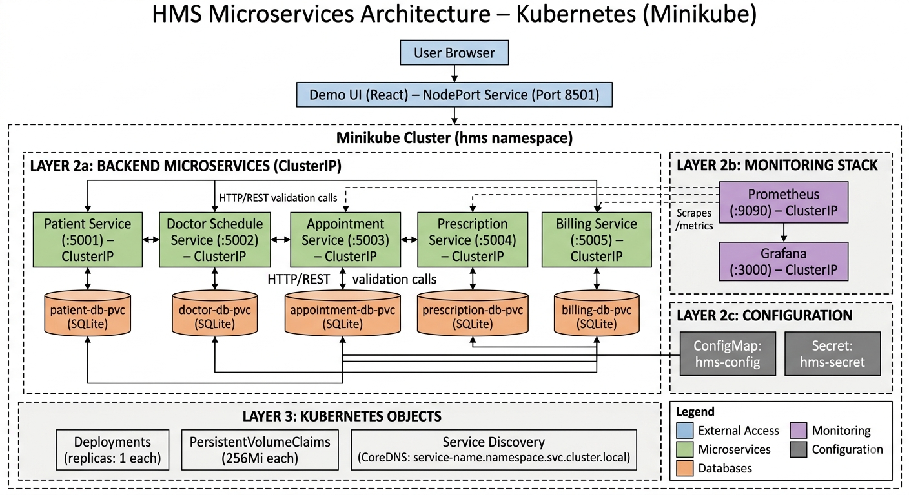
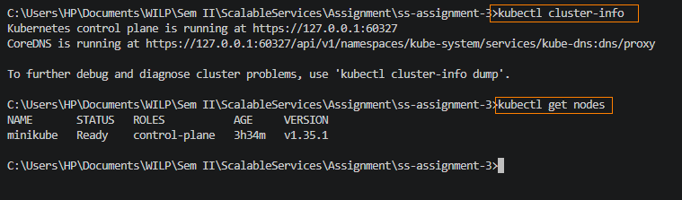
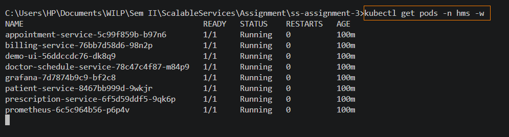
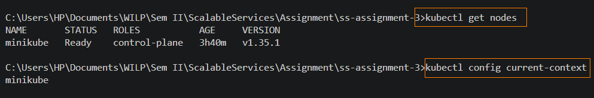
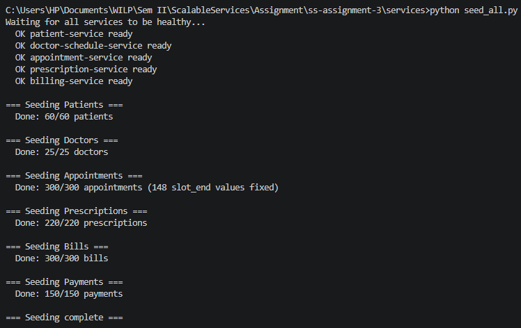
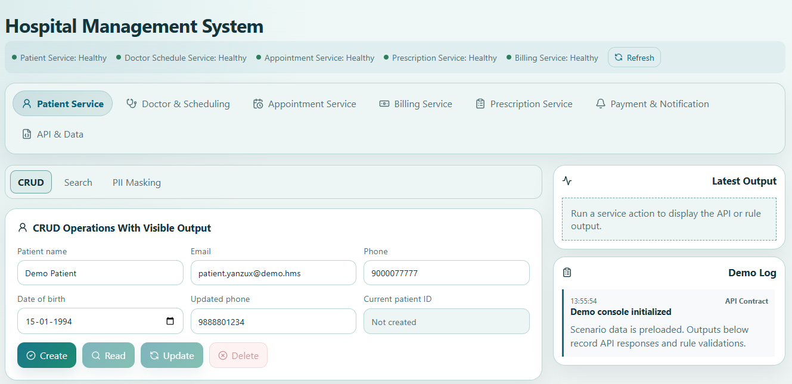
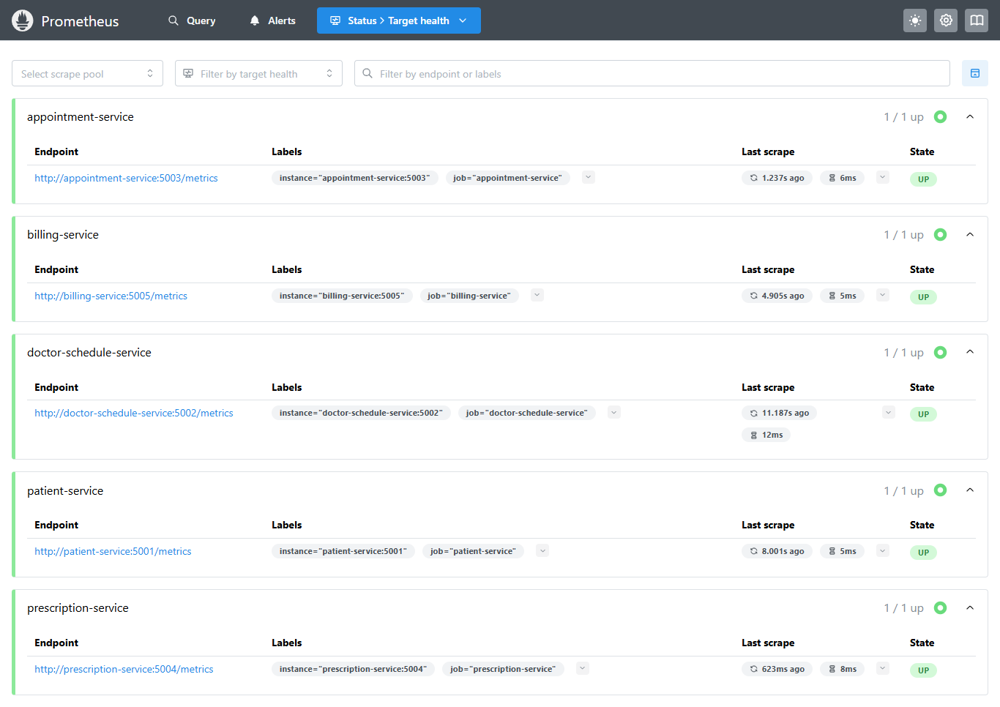
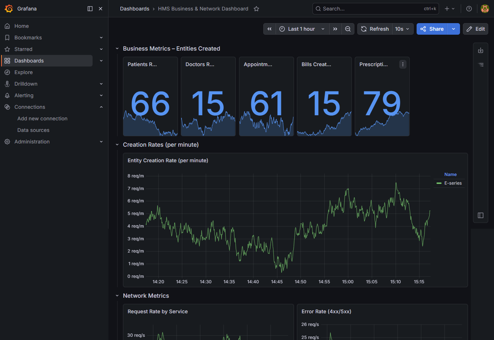
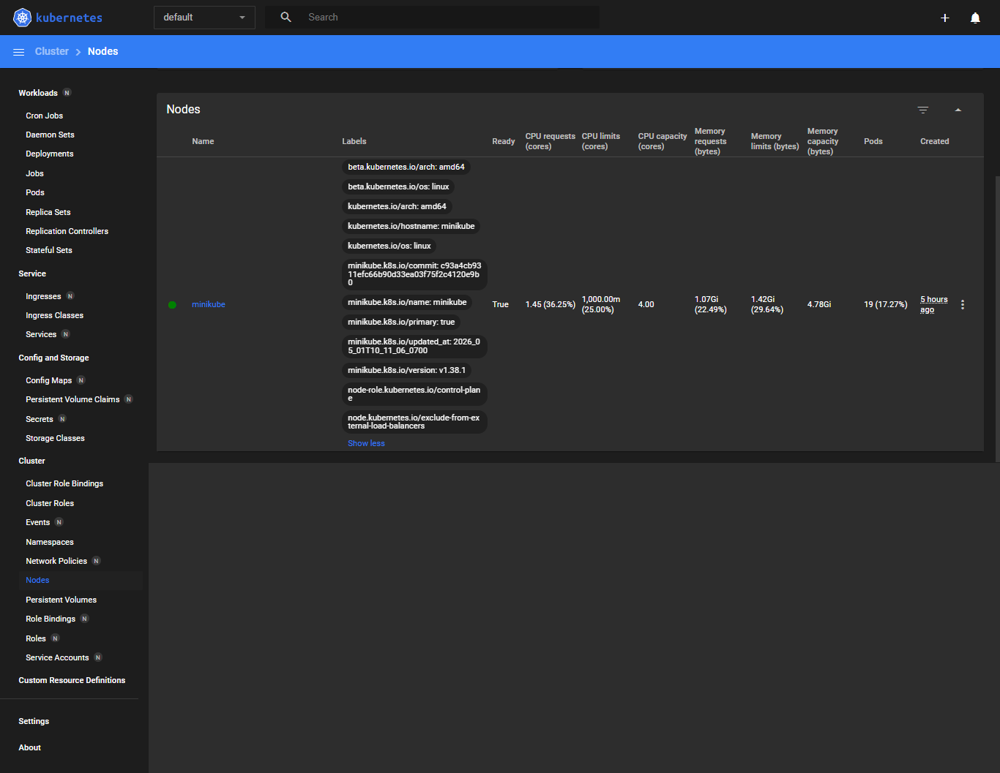

# Submission – Group 15

**Project Name:** Hospital Management System (HMS)  
**Group Name:** Group 15  
**Course:** Scalable Services – Microservices-Based Application Development  

---

## 1. Group Details & Individual Contribution

| S.No | Name | Email | Contribution (%) | Key Responsibilities |
|------|------|-------|------------------|----------------------|
| 1 | ADITYA SEKHAR | 2025tm93080@wilp.bits-pilani.ac.in | 20% | Patient Service & Appointment Service development; Minikube cluster setup; Kubernetes manifests; deployment orchestration |
| 2 | MANASA BHAT | 2025tm93082@wilp.bits-pilani.ac.in | 20% | Billing Service development; Prometheus & Grafana monitoring stack; metrics endpoint implementation |
| 3 | SHARMA VANDANA DINESHCHANDRA SHARDA | 2025tm93207@wilp.bits-pilani.ac.in | 20% | Prescription Service development; Docker Compose infrastructure; inter-service communication testing |
| 4 | PRASANNA VENKAT | 2024tm93611@wilp.bits-pilani.ac.in | 20% | Doctor Schedule Service development; CSV dataset preparation; seed script (`seed_all.py`); data normalization |
| 5 | UPPU VINOD KUMAR | 2025tm93233@wilp.bits-pilani.ac.in | 20% | Demo UI (React) development; Swagger UI integration; end-to-end workflow testing; documentation |

---

## 2. Brief Application Description

The **Hospital Management System (HMS)** is a microservices-based application that manages core hospital operations. It is built with Python/Flask, containerized with Docker, and orchestrated on Kubernetes (Minikube).

**What the system does:**

- **Patient Service** – Registers patients and manages patient profile data (name, email, phone, DOB).
- **Doctor Schedule Service** – Manages doctor profiles, specializations, and availability slots.
- **Appointment Service** – Creates, updates, reschedules, and tracks patient appointments with doctors.
- **Prescription Service** – Issues and manages prescriptions linked to completed appointments.
- **Billing Service** – Creates bills for appointments and records payments against bills.
- **Demo UI** – A React-based console that demonstrates all service capabilities, validation rules, workflow evidence, and live API responses.
- **Monitoring** – Prometheus scrapes `/metrics` endpoints from all five services; Grafana visualizes dashboards.

**Key architectural decisions:**
- **Database-per-service** pattern: each microservice owns its own SQLite database with a dedicated PersistentVolume in Kubernetes.
- **Synchronous HTTP/REST** inter-service communication: services validate dependent resources through REST calls rather than sharing databases (e.g., Appointment Service checks Patient Service and Doctor Schedule Service before booking).
- **Containerized & Orchestrated**: each service has its own Dockerfile; the entire stack runs on Minikube with Kubernetes Deployments, Services (ClusterIP), ConfigMaps, Secrets, and PersistentVolumeClaims.

---

## 3. System Architecture

### 3.1 Architecture Diagram



---

## 4. Step-by-Step Execution Instructions

### Prerequisites

- **Docker Desktop** installed and running
- **Minikube** installed (`winget install Kubernetes.minikube`)
- **kubectl** installed and available on PATH
- **Git** installed
- **Python 3.11+** installed

---

### 4.1 Clone the Consolidated Repository

```powershell
git clone https://github.com/adi-bits-2025/ss-assignment-3.git
cd ss-assignment-3
```
---

### 4.2 Start Minikube Cluster

```powershell
# Clean any previous instance
minikube delete --all --purge
docker rm -f minikube 2>$null

# Pre-pull the base image to avoid network hangs
docker pull gcr.io/k8s-minikube/kicbase:v0.0.50

# Start Minikube with Docker driver
minikube start --driver=docker --base-image="gcr.io/k8s-minikube/kicbase:v0.0.50"
```

**Verify the cluster:**

```powershell
kubectl cluster-info
kubectl get nodes
```


---

### 4.3 Build Docker Images Inside Minikube

Point your shell to Minikube's Docker daemon, then build all six images:

```powershell
minikube docker-env --shell powershell | Invoke-Expression

docker build -t patient-service:latest ./services/patient-service
docker build -t doctor-schedule-service:latest ./services/doctor-schedule-service
docker build -t appointment-service:latest ./services/appointment-service
docker build -t prescription-service:latest ./services/prescription-service
docker build -t billing-service:latest ./services/billing-service
docker build -t demo-ui:latest ./services/demo-ui

minikube docker-env --unset | Invoke-Expression
```
---

### 4.4 Create Namespace and Apply Kubernetes Manifests

```powershell
kubectl create namespace hms
kubectl apply -f infra/k8s/hms-storage.yaml -n hms
kubectl apply -f infra/k8s/hms-config.yaml -n hms
kubectl apply -f infra/k8s/hms-secret.yaml -n hms
kubectl apply -f infra/k8s/patient-service.yaml -n hms
kubectl apply -f infra/k8s/doctor-schedule-service.yaml -n hms
kubectl apply -f infra/k8s/appointment-service.yaml -n hms
kubectl apply -f infra/k8s/prescription-service.yaml -n hms
kubectl apply -f infra/k8s/billing-service.yaml -n hms
kubectl apply -f infra/k8s/prometheus-config.yaml -n hms
kubectl apply -f infra/k8s/prometheus-deployment.yaml -n hms
kubectl apply -f infra/k8s/grafana-deployment.yaml -n hms
kubectl apply -f infra/k8s/demo-ui.yaml -n hms
```

---

### 4.5 Wait for All Pods to Be Ready

```powershell
kubectl get pods -n hms -w
```


---

### 4.6 Verify Minikube Cluster (Evidence)

```powershell
kubectl get nodes
kubectl config current-context
```


---

### 4.7 Start Port-Forwarding and Seed the Database

Open **five background jobs** for port-forwarding:

```powershell
Start-Job { kubectl port-forward -n hms svc/patient-service 5001:5001 }
Start-Job { kubectl port-forward -n hms svc/doctor-schedule-service 5002:5002 }
Start-Job { kubectl port-forward -n hms svc/appointment-service 5003:5003 }
Start-Job { kubectl port-forward -n hms svc/prescription-service 5004:5004 }
Start-Job { kubectl port-forward -n hms svc/billing-service 5005:5005 }
```

Wait 5 seconds, then seed:

```powershell
cd services
python seed_all.py
```


### 4.8 Access the Demo UI

```powershell
minikube service demo-ui -n hms --url
```


---

### 4.9 Access Prometheus

Port-forward Prometheus and open it in your browser:

```powershell
Start-Job { kubectl port-forward -n hms svc/prometheus 9090:9090 }
```

---

### 4.10 Access Grafana

Port-forward Grafana and open it in your browser:

```powershell
Start-Job { kubectl port-forward -n hms svc/grafana 3000:3000 }
```
Navigate to `http://localhost:3000`. Login with default credentials (`admin`/`admin`).

Add Prometheus as a data source:
1. Go to **Configuration → Data Sources → Add data source**.
2. Select **Prometheus**.
3. Set URL to `http://prometheus:9090`.
4. Click **Save & Test**.


---

### 4.11 Explore Kubernetes Features (Optional Demos)

**Minikube Dashboard:**

```powershell
minikube dashboard
```


**Self-Healing Demonstration:**

```powershell
kubectl delete pod -n hms -l app=patient-service
kubectl get pods -n hms -w
```
Observe Kubernetes automatically recreating the terminated pod.

**View Pod Logs:**

```powershell
kubectl logs -n hms deployment/patient-service --tail=20
```

**Check Resource Usage:**

```powershell
minikube addons enable metrics-server
kubectl top pods -n hms
```

---

### 4.12 (Alternative) One-Click Deployment with restart-hms.ps1

For a complete clean restart, use the automated PowerShell script:

```powershell
.\restart-hms.ps1
```

This script performs all steps 4.1–4.7 automatically:
- Deletes existing `hms` namespace
- Rebuilds all Docker images inside Minikube
- Recreates namespace and applies all manifests
- Creates the `doctor-service` alias
- Waits for all pods to be ready
- Starts port-forwarding background jobs
- Runs the seed script
- Prints the Demo UI URL

---

### 4.13 Stop and Clean Up

```powershell
# Stop port-forwarding jobs
Get-Job | Stop-Job
Get-Job | Remove-Job

# Delete the namespace (removes all resources)
kubectl delete namespace hms

# Stop Minikube
minikube stop
```

---

## 5. GitHub Repository Links

| Service | Repository URL |
|---------|---------------|
| **Consolidated Repository** | [https://github.com/adi-bits-2025/ss-assignment-3](https://github.com/adi-bits-2025/ss-assignment-3) |
| Patient Service | [https://github.com/adi-bits-2025/patient-service](https://github.com/adi-bits-2025/patient-service) |
| Doctor Schedule Service | [https://github.com/adi-bits-2025/doctoer-schedule-service](https://github.com/adi-bits-2025/doctoer-schedule-service) |
| Appointment Service | [https://github.com/adi-bits-2025/appointment-service](https://github.com/adi-bits-2025/appointment-service) |
| Prescription Service | [https://github.com/adi-bits-2025/prescription-service](https://github.com/adi-bits-2025/prescription-service) |
| Billing Service | [https://github.com/adi-bits-2025/billing-service](https://github.com/adi-bits-2025/billing-service) |

---
